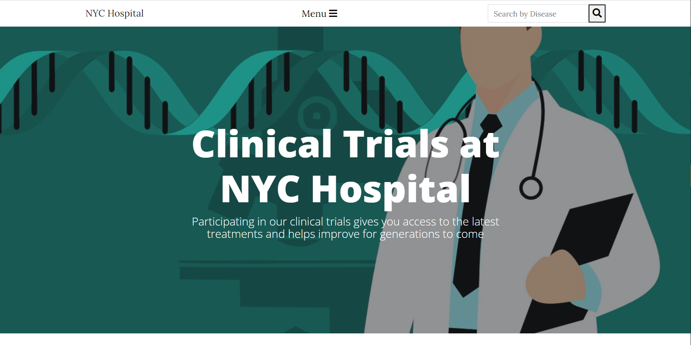
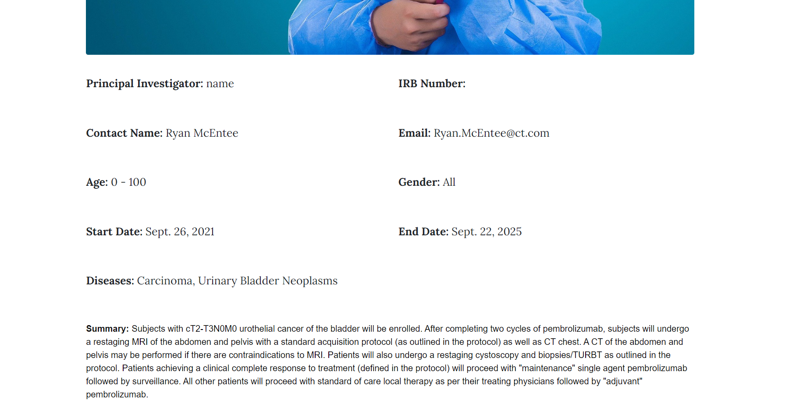
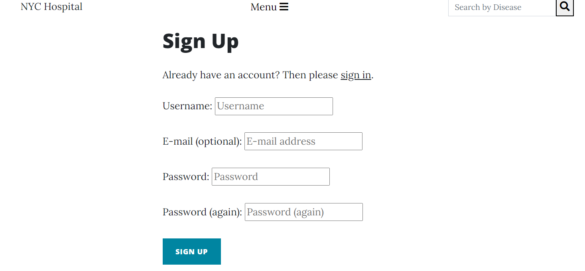
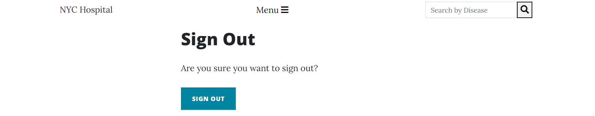
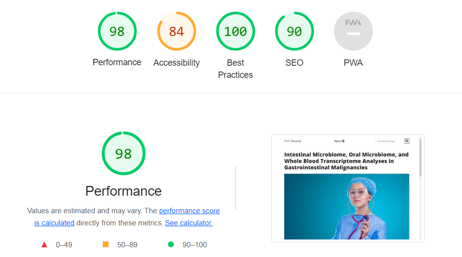
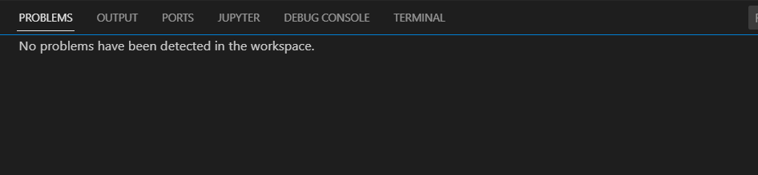

# Clinical Trials at NYC Hospital

## Introduction
The idea of this project was based around the healthcare industry. This is an industry that I currently work in. With the recent COVID-19 pandemic brining the entire world to stand still, healthcare and more importantly, clinical research are in the spotlight more than ever before. This website allows users to search through clinical trials, view details about the trial and enroll in it. In order to enroll in a trial, a user mist first register on the website. With some many clinical trials out there, this website displays the trials in a nice compact and easy to read format.

## Version Control
Github was used to track the progress of this project. You can see my commit messages at: https://github.com/jcurran1289/PP4-Clinicaltrials/commits/main

## User Experience
The user experience I wanted the user to be able to look and find the information as quickly as possible. The website is easy and straight forward to register and sign up to. I wanted the main content of the website to be accessible to all users while only registered users have the ability to enroll in a study.

## Design
I wanted to keep the style of the website very simple so the focus would be on the clinical trials.

### Colours
The website is all white. I felt this would be the least distracting to the user when reviewing a trial.

### Icons
The Icons used are created with the help of the following sites:
    - [fontawesome](https://fontawesome.com/start)

## User stories
My goal was to provide the user with a simple a straight forward website to find a clinical trial. A lot of hospitals do not put a lot of effort into their CT (clinical trial) websites. They usually just post a title of a CT and a few paragraphs describing it while a lot of medical terms. This can leave the user unsure what the actual disease that is being treated and if they are eligible or not. This website displays the disease and enrollment criteria very clearly for the user to see.

User Stories can be found at https://github.com/users/jcurran1289/projects/2 

* As a **User**, I can easily navigate through the list clinical trials
* As a **User**, I can easily search clinical trials through disease site
* As a **User**, I want to be able to have the same functionalities on different devices (mobile, tablet and PC).
* As a **User**, I want to be able to sign up for an account.
* As a **Registered User**, I can easily login and logout of my account.
* As a **Registered User**, I can easily post questions on the clinical trials page
* As a **Registered User**, I can easily enroll in a study 
* As a **Site Owner/Super user**, I can create new clinical trials.
* As a **Site Owner/Super user**, I want to be able to edit and delete clinical trials.
* As a **Site Owner/Super user**, I want to be able to access the admin section of the site to view questions and delete them.

## Data Models

### Post
This data model is used to store all the relevant information about a listed clinical trial:
| Field            | Data Type       | Purpose                                                | Form Validation                                  |   |
|------------------|-----------------|--------------------------------------------------------|--------------------------------------------------|---|
| title            | CharField       | Name of clinical trial                                 | required, max length 200, unique                 |   |
| slug             | SlugField       | Urls and unique identifier                             | required, max length 200, unique                 |   |
| author           | ForeignKey      | User that created the post                             | related name is recipe_post, default is 0        |   |
| IRB_number       | CharField       | Institutional Review Board Application Number          | max length 200, default is 101                   |   |
| prin_invest      | CharField       | Principal Investigator of the trial                    | max length 200, default is name                  |   |
| contact_name     | CharField       | Name of person to contact for details about the trial  | max length 400, unique is False, default is name |   |
| contact_email    | CharField       | Email of person to contact for details about the trail | max length 200, unique is False, default is null |   |
| primary_disease  | CharField       | what disease the study is researching                  | max length 5000, blank is True                   |   |
| eligible_age_min | IntegerField    | Minimum age to enroll in the trial                     | blank is False, default is 0                     |   |
| eligible_age_max | IntegerField    | Maximum age to enroll in the trial                     | blank is False, default is 100                   |   |
| gender           | IntegerField    | Gender eligibility                                     | default is 0                                     |   |
| main_image       | CloudinaryField | To store images                                        | default is placeholder                           |   |
| content          | CharField       | The full description of the trial                      | max length 5000, blank is true                   |   |
| no_participants  | ManyToManyField | The number of participants enrolled in the trial       | related name is ct_no_participants               |   |
| status           | IntegerField    | The current status of the trial                        | default is 0                                     |   |
| start_dt         | DateField       | The date the trial began enrolling                     | default is 2022-09-22                            |   |
| end_dt           | DateField       | The date the trail stops enrolling                     | default is 2022-09-22                            |   |
| created_on       | DateField       | The date the post was created in the database          | auto now add is True                             |   |
| updated_on       | DateField       | The date the post was last updated in the database     | auto now is True                                 |   |

- [x] Create - Admin can create posts via django administration interface
- [x] Read - Every user can read the post details in their page 
- [x] Update - Admin can Update a post via django administration
- [x] Delete - Admin can Delete a post via django administration

| Field      | Data Type     | Purpose                                     | Form Validation             |
|------------|---------------|---------------------------------------------|-----------------------------|
| post       | ForeignKey    | One to many relation                        | required but automatic      |
| name       | CharField     | Name of user asking question                | required but automatic      |
| email      | EmailField    | To be stored in database                    | required but automatic      |
| body       | TextField     | To be shown, it is the question being asked | required                    |
| created_on | DateTimeField | To be shown below the question              | required but automatic      |
| approved   | BooleanField  | To let admin approve before publishing      | required, auto is False (*) |

- [x] Create - Every registered and logged in user can ask questions to the study team about the study.
- [x] Read - Every user can read the comments of other users

## FEATURES

### Navigation Bar:
The navigation bar is simple and easy to use. It appears on all pages. They can always return to the home page  which displays the list of available trials. They can log in, register or log out.

#### Search Bar:
Within the navigation bar, there is a search function. this gives the users the ability to search for a study based on what disease the study researching. When a disease is searched, the search function returns a list of studies that have that disease listed under disease site

### Home Page - Clinical Trial Study list
In the homepage the user receives a welcome message to the site and can view all the featured stocks, scrolling down or going to the following pages.
On the hompage the user is welcomed by a large image of Clinical Trials at NCY hospital. When they scroll down they can see all the trials at the institute 
Each trial post has the trial title and a brief summary of the trial underneath
By clicking on a trial's title, the user is take to the trial page.

### Clinical Trial Detail Page
Here the user can find the following sections:

- STUDY PAGE
Here a user can view a clinical trial entered by the admin and all the details about that trial. When not registered you can still read the details about the trial, when logged in a user can enroll and ask the study team a question about the trail. 

 - ENROLL SECTION
Here a user can enroll in the trial if they like the trial. If they decide to leave the trial they can click on leave which removes them from the trial. The number of enrolled participants is also displayed in the section 

 - QUESTION SECTION 
Here a user can ask the study team a question they have regarding the trial when they are logged in. They can also view previous questions users have asked. All questions asked are readable by registered and non-registered users

!IMAGE

- SIGN IN
Users who have already registered can sign in, enroll in studies and ask questions. 

- REGISTER
Users can sign up for an account if they do not already have one. 

- SIGN OUT
Users who are logged in can easily log out. 

## Future Feautures

- 404 page
A modified 404 page to suit the style of the website.

- 500 page
A modified 500 page to suit the style of the website.

- CT.gov API
Incorporate the CT.gov api on the website so the admin would not have to enter studies 

## Testing
All the HTMl and CSS code works as expected and as well as going through the website manually, I have tested the HTML, CSS and Django code using third party validations such as Pep8 for Django and W3C validation for HTML and CSS.

### Lighthouse Audit 

### Validator Testing 

#### W3C CSS Validation 
Passed through the CSS validator with no errors.
!IMAGE

#### HTML Validator 
All pages passed through HTML Validator with no errors.
!IMAGE

#### PEP8
All python files passed through PEP8 validator in the Gitpod Workspace with no errors. 

## Bugs
See issues in github: https://github.com/jcurran1289/PP4-Clinicaltrials/issues

## Deploying to Heroku
Go onto Heroku
Login to my account.
Click create new app.
I choose a name for my project and the region that I am in (US).
Go to setting.
Click on reveal config vars
Add in CLOUDINARY_URL, DATABASE_URL and your secret_key
Go to resources and search for Postgres, and install the Heroku Postgres
Go to Deploy
Connect to github login.
Search for the project you wish to connect. Once found click the connect button After this I click the deploy button at the bottom.

## Tech used
ist first register on the website. With some many clinical trials out there, this website displays the trials in a nice compact and easy to read format.

## Credits

### Content Credits
- Clinical trials details were found at: https://www.mountsinai.org/clinical-trials

### Code Credits 
- Bootstrap template was found at: https://startbootstrap.com/
- The code structure is based on the material provided during the Code Institute course, especially from the I think therefore i blog walkthrough project.

 ### Media Credits
- Site images were found at : https://unsplash.com/s/photos/html

## Acknowledgments
- I  had help from my amazing mentor Malia. 